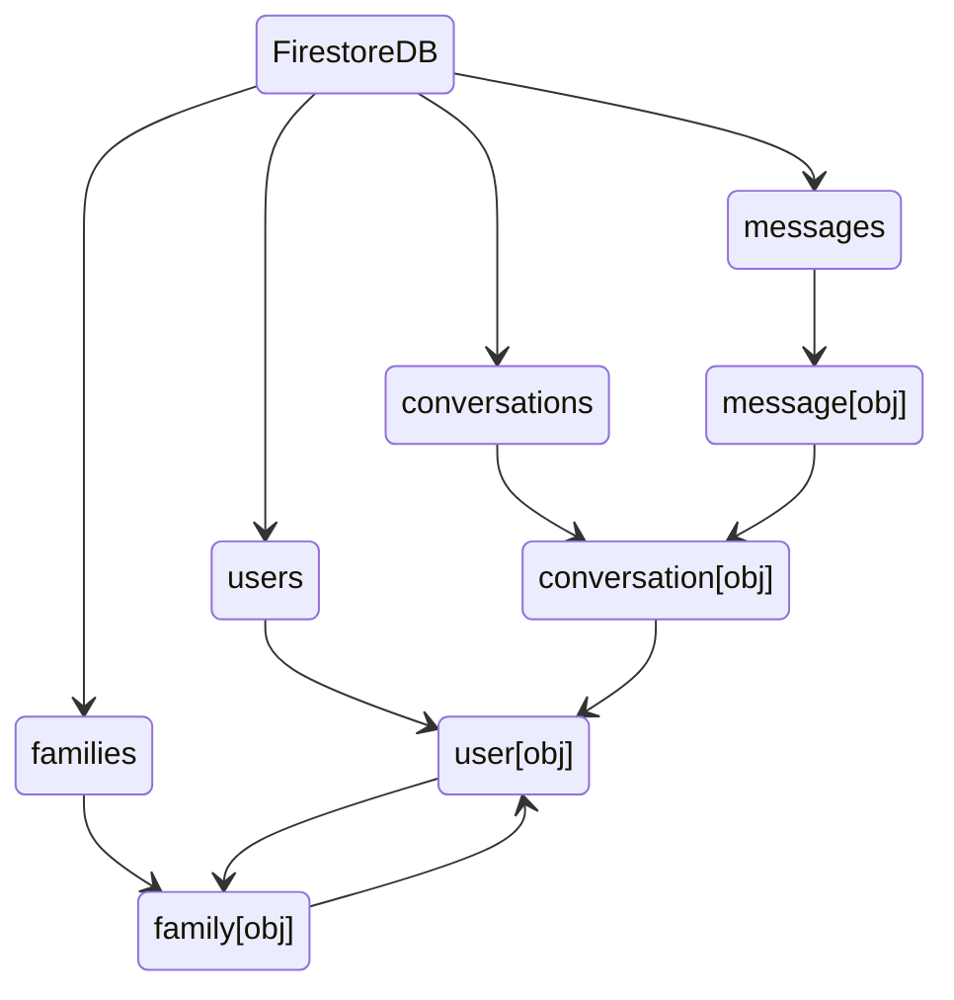

# DB Schema

---

## Summary

* FirestoreDb
  * Collections
  * References
* RealtimeDb

---

## FirestoreDb

The FirestoreDB will store the permanent data of conversations, users, etc

| Collection Name | Short description |
| --------------- | ----------------- |
| users | Stores the users details that are not saved by the FirebaseAuth. |
| conversations | Stores the conversations details : 2 peoples + lastRead + lastMessageRef |
| messages | Stores the message : conversationId + createdDate + read |
| families | Stores the families details : members + code + name |


> For the User, do **not** use auto-generated ID. FirebaseAuth generates UID that can be used as the ID, and makes it easier to link to the user document

> The User document does not have the email as it is stored with the FirebaseAuth. 

```dart
class User {
    final DateTime createdAt;
    final DateTime lastLogin;
    final String firstName;
    final String lastName;
	final DocumentReference family;
}
```

```dart
class Conversation {
    final List<DocumentReference> members; // can be 2 people conv, or the entire family(.members) 
    final DateTime lastRead;
    final String name;
    final int msgCount;
}
```

```dart
class Message {
    final DocumentReference conversation;
    final DocumentReference sender;
    final String content;
    final DateTime createdAt;
    // final bool read;
}
```

```dart
class Families {
    final List<DocumentReference> members;
    final String name;
    final String code; // sha1(familyName + Date.now()).slice(0, 9)
}
```



## RealtimeDB

The RTDB stores the data as json. When a conversation is opened, load the last 10 messages in RTDB, and add all other messages afterwards. When conversation is closed, save all messages into FirestoreDB.

As 50 simultaneous convs max, might have to change or not use RTDB at all

```json
{
    '{conversationID}': {
        'dest': '',
        'src': '',
        'lastRead': '',
        'lastMessage': '',
        'messages': [
            {
                'conversation': '{conversationId}',
                'content': 'hello grand pere',
                'read': false
            },
            // last 10 message
        ]
    }
}
```